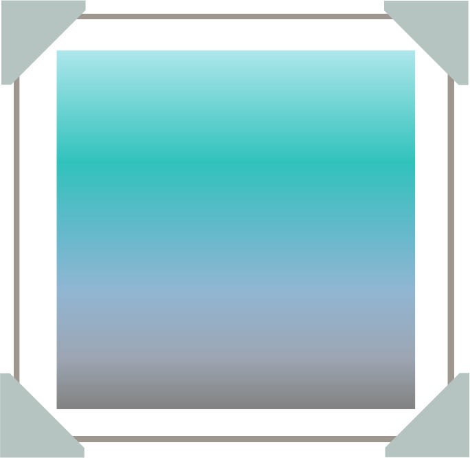

<p align="center"></p>

<h1 align="center">Monet Plugin for Craft CMS</h1>

A Monet field can be added to asset elements which will generate and store an efficient placeholder image to be displayed inline, whilst the full asset is loading.

## Requirements

This plugin requires Craft CMS 3.4.0 or later.

## Installation

You can install this plugin from the Plugin Store or with Composer.

#### From the Plugin Store

Go to the Plugin Store in your project’s Control Panel and search for “Postmark”. Then click on the “Install” button in its modal window.

#### With Composer

Open your terminal and run the following commands:

```bash
# Navigate to the project directory
cd /path/to/my-project

# Tell Composer to load the plugin
composer require dyerc/craft-monet

# Tell Craft to install the plugin
./craft install/plugin craft-monet
```

## Usage

Once Monet is installed:

#### Create Your Field

1. Add a new field to your project with the Monet field type. The name and handle are up to you.
2. Monet can operate in one or two different modes:
   1. **Micro Preview** a 16px wide JPEG image will be stored in the database for each asset with the field
   2. **Color Palette** 5 hex codes from the most prominent image colors will be stored in the database for each asset with the field
3. Attach your Monet field to one or more asset volumes
4. If you have existing assets in the volume, optionally process them all immediately by running: `./craft monet/assets/generate`

#### Templating

Your template could look something like:

```twig

```

This would output an inline data url such as `data:image/svg+xml;base64,...` in the src attribute. By default an SVG is used with a blur filter so that the grainy nature of a very small image is less obvious.

To control the amount of blur in the SVG, supply an int argument to `dataUrl`. This is recommended between 0 - 100. A preview can be seen in the Monet field of assets in the control panel. A more explicit, equivalent function `blurredDataUrl` is available which `dataUrl` is an alias to.

Alternatively, to access an inline JPEG data url such as `data:image/jpeg;base64,...` use the `rawDataUrl` function.

Access the generated color palette through the `colorPalette`, `primaryColor` or `secondaryColor` properties on your Monet field. For example:

```twig

```